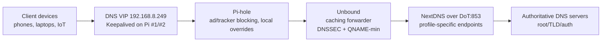

# Orion DNS + NextDNS v1.1

> Complete specification for the Orion Sentinel DNS stack with NextDNS over DNS-over-TLS (DoT)

## Overview

This document describes the **Orion DNS + NextDNS v1.1** architecture, which integrates NextDNS as a privacy-friendly upstream DNS provider using encrypted DNS-over-TLS (DoT).

### Key Features

- **High Availability**: Two Raspberry Pi nodes with Keepalived VIP failover
- **Privacy-Enhanced DNS**: All queries encrypted via DoT to NextDNS
- **Ad/Tracker Blocking**: Pi-hole provides local filtering and blocking
- **Caching & DNSSEC**: Unbound handles caching with full DNSSEC validation
- **Full Observability**: Prometheus, Grafana, and Loki integration

---

## 1. Architecture and Flow



### Component Roles

| Component | Role | Location |
|-----------|------|----------|
| **Keepalived** | Exposes a single floating VIP for DNS | Both Pis (MASTER/BACKUP) |
| **Pi-hole** | DNS sinkhole, ad/tracker blocking, local overrides | Both Pis |
| **Unbound** | Caching forwarder with DNSSEC validation | Both Pis |
| **NextDNS** | Privacy-friendly upstream via DoT | Cloud (NextDNS servers) |

### Node Configuration

- **Pi #1 (PRIMARY)**: Pi-hole + Unbound + Keepalived (MASTER, priority 100)
- **Pi #2 (SECONDARY)**: Pi-hole + Unbound + Keepalived (BACKUP, priority 90)
- **VIP (e.g. 192.168.8.249)**: Exposed by Keepalived; only DNS IP handed out via DHCP

---

## 2. Unbound → NextDNS DoT Configuration

Unbound is configured as a **caching forwarder** (not a full recursive resolver). All queries are forwarded to NextDNS using DNS-over-TLS on port 853.

### Configuration Example

Located in `stacks/dns/unbound/unbound.conf`:

```conf
server:
    # Network Configuration
    interface: 0.0.0.0
    port: 5335
    do-ip4: yes
    do-ip6: yes
    do-udp: yes
    do-tcp: yes
    
    # TLS Configuration for DoT upstream
    tls-cert-bundle: "/etc/ssl/certs/ca-certificates.crt"
    
    # Security Settings (MUST remain enabled)
    qname-minimisation: yes
    harden-dnssec-stripped: yes
    
    # DNSSEC Validation
    module-config: "validator iterator"
    auto-trust-anchor-file: "/var/lib/unbound/root.key"

# NextDNS over DoT Forwarding
forward-zone:
    name: "."
    forward-tls-upstream: yes
    # Replace with your profile-specific NextDNS endpoints
    forward-addr: 45.90.28.0@853#dns.nextdns.io
    forward-addr: 45.90.30.0@853#dns.nextdns.io
    # IPv6 (optional)
    # forward-addr: 2a07:a8c0::@853#dns.nextdns.io
```

> **Note:** Unbound does not support environment variable substitution natively. You must manually edit the `forward-addr` lines in `stacks/dns/unbound/unbound.conf` with your NextDNS profile-specific IP addresses. Alternatively, use a templating tool like `envsubst` if you need automated configuration.

### Environment Variables

The following environment variables are provided for documentation and potential templating use:

```bash
# Enable NextDNS integration
NEXTDNS_ENABLED=true

# NextDNS IPv4 endpoint (replace with your profile-specific IP)
NEXTDNS_IPV4=45.90.28.0

# NextDNS IPv6 endpoint (optional)
NEXTDNS_IPV6=

# NextDNS DoT port
NEXTDNS_DOT_PORT=853

# NextDNS hostname for TLS verification
NEXTDNS_HOSTNAME=dns.nextdns.io
```

---

## 3. Pi-hole Upstream Configuration

Pi-hole uses Unbound as its **only upstream DNS**. No direct external resolvers are configured.

### Configuration

Both Pi-hole instances (primary and secondary) point to their local Unbound:

```bash
# In docker-compose.yml environment
PIHOLE_DNS_1=unbound_primary#5335    # Primary Pi-hole
PIHOLE_DNS_1=unbound_secondary#5335  # Secondary Pi-hole
```

Or via `.env`:

```bash
PIHOLE_DNS_PRIMARY=unbound_primary#5335
PIHOLE_DNS_SECONDARY=unbound_secondary#5335
```

### Important

- **Remove** any direct external resolvers (Google DNS, Cloudflare, etc.) from Pi-hole
- Pi-hole → Unbound → NextDNS over DoT is the **only path** for external queries
- Local overrides and LAN zones continue to work as expected

---

## 4. Keepalived VIP & HA Configuration

### VIP Architecture

- Only the **VIP** should be used as DNS by LAN clients
- Node-specific IPs (e.g., 192.168.8.241, 192.168.8.242) are **not** handed out by DHCP

### Key Environment Variables

```bash
# Virtual IP for DNS service (floats between Pi1 and Pi2)
DNS_VIP=192.168.8.249

# Enable Keepalived
KEEPALIVED_ENABLED=true

# Priorities (higher = more likely to be MASTER)
KEEPALIVED_PRIORITY_PI1=100  # Primary
KEEPALIVED_PRIORITY_PI2=90   # Secondary

# VRRP Authentication
VRRP_PASSWORD=<your-secure-password>
```

### Router DHCP Configuration

Configure your router to hand out **only the VIP** as the DNS server:

```
DNS Server: 192.168.8.249
```

---

## 5. NextDNS Dashboard Configuration

### Setting Up Your Profile

1. Go to [https://my.nextdns.io](https://my.nextdns.io)
2. Create a new profile (or use existing)
3. Note your **profile-specific endpoints** from Setup Guide → Endpoints

### Privacy Settings (Recommended)

Navigate to **Settings** in your NextDNS profile:

| Setting | Recommendation | Notes |
|---------|---------------|-------|
| **Logs** | Minimal retention (e.g., 1 week) or disabled | Maximum privacy |
| **Analytics** | Basic or disabled | Reduces data collection |
| **Storage Location** | Select preferred region | GDPR compliance |
| **Block Page** | Enabled with custom message | User experience |

### Security Features (Recommended)

Enable in **Security** tab:

- ✅ Threat Intelligence Feeds
- ✅ Google Safe Browsing
- ✅ Cryptojacking Protection
- ✅ DNS Rebinding Protection
- ✅ IDN Homograph Attacks Protection

---

## 6. Monitoring & Observability

### Prometheus Scrape Targets

The following are automatically scraped:

| Job | Description | Port |
|-----|-------------|------|
| `node-exporter` | System metrics (CPU, RAM, disk) | 9100 |
| `pihole-primary` / `pihole-secondary` | Pi-hole query and block metrics | 9617 |
| `unbound-primary` / `unbound-secondary` | Unbound cache and latency metrics | 9167 |
| `dns_vip_probe` | VIP availability (blackbox) | 9115 |
| `nextdns_dot_probe` | NextDNS DoT health (TLS check) | 9115 |

### Grafana Dashboard

Use the **"Orion DNS + NextDNS"** dashboard (`orion-dns-nextdns.json`) which includes:

- VIP status (probe_success)
- Pi-hole query rate and blocked percentage
- Unbound avg query latency and cache hit ratio
- NextDNS DoT health status
- SERVFAIL and error rates
- System resource usage (CPU, memory)

### Loki Log Queries

Search for DNS-related issues:

```logql
# Unbound DoT/upstream errors
{container_name="unbound_primary"} |= "error" or |= "SERVFAIL"

# Pi-hole query patterns
{container_name="pihole_primary"} |= "query"

# Keepalived state changes
{container_name="keepalived"} |= "MASTER" or |= "BACKUP" or |= "FAULT"
```

---

## 7. Acceptance Tests

Run these after deployment or configuration changes.

### 7.1 Basic DNS via VIP

```bash
# Normal resolution
dig example.com @192.168.8.249

# DNSSEC validation test (should fail/validate)
dig dnssec-failed.org @192.168.8.249 +dnssec

# Should return: SERVFAIL (DNSSEC validation failure expected)
```

### 7.2 Check Pi-hole is in the Path

1. Visit `http://192.168.8.249/admin`
2. Verify:
   - Query counters increase when you dig or browse
   - Blocked queries appear for known ad/tracker domains

```bash
# Test a known ad domain (should be blocked)
dig ads.google.com @192.168.8.249
```

### 7.3 Check Unbound → NextDNS DoT

1. From a LAN client, open the [NextDNS test page](https://test.nextdns.io)
2. Verify:
   - Status shows "Using NextDNS"
   - Protocol shows DoT (or expected)

3. In NextDNS dashboard:
   - Confirm queries are logged (if logging enabled)
   - Check queries come from your WAN IP

```bash
# Check TLS connection to NextDNS
openssl s_client -connect 45.90.28.0:853 -servername dns.nextdns.io </dev/null
```

### 7.4 Monitoring & Observability

1. Open Grafana → "Orion DNS + NextDNS" dashboard
2. Verify:
   - VIP probe (`probe_success`) is green
   - Pi-hole panels show sane query and block rates
   - Unbound panels show reasonable latency
   - NextDNS DoT status is green

3. In Prometheus → Status → Targets:
   - `node_exporter` on both Pis: UP
   - `pihole-*` and `unbound-*` jobs: UP
   - `dns_vip_probe` and `nextdns_dot_probe`: UP

### 7.5 HA Failover Test

```bash
# From LAN, continuously test DNS resolution
watch -n 2 'dig example.com @192.168.8.249 +short'
```

1. Reboot or stop DNS containers on Pi #1 (MASTER):
   ```bash
   docker compose --profile two-pi-ha-pi1 down
   ```

2. Confirm:
   - VIP moves to Pi #2
   - `dig` keeps working with minimal interruption
   - Grafana shows Pi #1 as down, Pi #2 as serving

3. Bring Pi #1 back up:
   ```bash
   docker compose --profile two-pi-ha-pi1 up -d
   ```

4. Verify VIP returns to Pi #1 (preemption)

---

## 8. Troubleshooting

### NextDNS Not Working

```bash
# Test DoT connectivity
dig @45.90.28.0 -p 853 +tls example.com

# Check Unbound logs
docker logs unbound_primary 2>&1 | grep -i "error\|fail\|tls"

# Verify TLS certificates are available
docker exec unbound_primary ls -la /etc/ssl/certs/ca-certificates.crt
```

### VIP Not Responding

```bash
# Check Keepalived status
docker logs keepalived

# Verify VIP is assigned
ip addr show | grep 192.168.8.249

# Check VRRP traffic
tcpdump -i eth0 vrrp
```

### Pi-hole Not Using Unbound

```bash
# Check Pi-hole upstream settings
docker exec pihole_primary cat /etc/pihole/setupVars.conf | grep PIHOLE_DNS

# Test Unbound directly
dig @unbound_primary -p 5335 example.com
```

---

## 9. Privacy Flow Summary

```
┌─────────────────────────────────────────────────────────────────┐
│                         YOUR LAN                                │
│                                                                 │
│  [Device] ──────► [VIP] ──────► [Pi-hole] ──────► [Unbound]    │
│                   │              │                 │            │
│                   │              │ Local filtering │ DNSSEC     │
│                   │              │ Ad blocking     │ QNAME-min  │
│                   │              │ Custom DNS      │ Caching    │
│                   │              └─────────────────┴────────────│
│                   │                                             │
└───────────────────┼─────────────────────────────────────────────┘
                    │
                    │ Encrypted DoT (port 853)
                    ▼
┌─────────────────────────────────────────────────────────────────┐
│                       NEXTDNS CLOUD                             │
│                                                                 │
│  • Privacy-friendly resolution                                  │
│  • Configurable logging/analytics                               │
│  • Additional threat protection                                 │
│  • No direct LAN client visibility                              │
└─────────────────────────────────────────────────────────────────┘
```

**Key Privacy Benefits:**

- ✅ LAN clients never communicate directly with external DNS
- ✅ All upstream queries encrypted via DoT
- ✅ NextDNS sees queries from VIP/WAN IP only (not individual devices)
- ✅ Pi-hole provides local logging if needed
- ✅ NextDNS logging can be minimized or disabled

---

## 10. Files Changed

| File | Description |
|------|-------------|
| `stacks/dns/unbound/unbound.conf` | Updated to forward to NextDNS over DoT |
| `.env.example` | Added NextDNS configuration variables |
| `.env.multinode.example` | Added NextDNS configuration variables |
| `env/.env.two-pi-ha.example` | Added NextDNS configuration variables |
| `stacks/monitoring/prometheus/prometheus.yml` | Added VIP and NextDNS DoT probes |
| `stacks/monitoring/blackbox/blackbox.yml` | Added TLS probe module for NextDNS |
| `stacks/monitoring/grafana/dashboards/orion-dns-nextdns.json` | New dashboard |
| `docs/orion-dns-nextdns-v1.1.md` | This documentation |

---

## Version History

| Version | Date | Changes |
|---------|------|---------|
| 1.1 | 2024 | Initial NextDNS DoT integration |
| 1.0 | 2023 | Original recursive resolver design |
